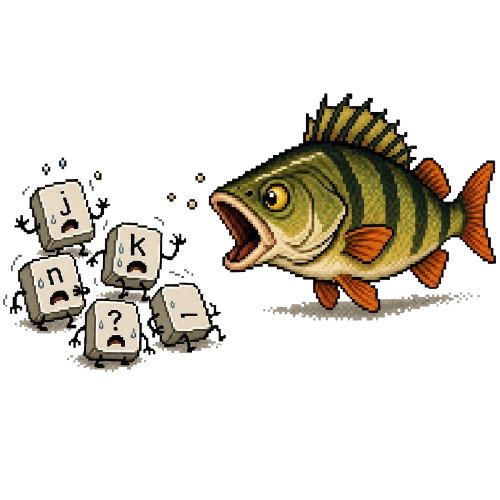

# Keymuncher

<div align="center">
  
</div>

Nastavení požírání kláves Okounem.

## TLDR

Okoun bere holé klávesy `j`, `k`, `n`, `?` a `_` pro vlastní zkratky. Ve Firefoxu tím rozbíjí type-ahead-find. Keymuncher tyhle klávesy zastaví dřív, než je Okoun sežere.

## Instalace

[Nainstalovat Keymuncher](https://raw.githubusercontent.com/hanenashi/keymuncher/main/keymuncher.user.js)

[Nainstalovat Keymuncher Lite](https://raw.githubusercontent.com/hanenashi/keymuncher/main/keymuncher.lite.user.js)

Odkaz otevři v prohlížeči s Tampermonkey nebo Violentmonkey. Správce userscriptů by měl nabídnout instalaci nebo aktualizaci.

## Verze

- Keymuncher: `0.3.0`
- Keymuncher Lite: `0.1.0`

## Keymuncher

Plná verze má nastavovací popup, ikonku a volitelné vlastní zkratky.

- `?` nebo `_` otevře nastavení Keymuncheru místo původní okouní nápovědy.
- Přepínač `Požírání kláves` určuje, jestli Okoun smí dál chytat `j`, `k`, `n`, `?`, `_`.
- Sekce `Vlastní zkratky` umí zapnout remapy pro další příspěvek, předchozí příspěvek a nejstarší nepřečtený.

Výchozí testovací stav: požírání kláves je vypnuté, takže Keymuncher Okounu blokuje problematické klávesy. Před finálním releasem přepneme výchozí stav podle dohody na požírání zapnuté.

## Keymuncher Lite

Lite verze nedělá nic viditelného. Nemá nastavení, ikonky ani remapy. Dokud je userscript zapnutý, tiše blokuje Okounu holé klávesy `j`, `k`, `n`, `?`, `_`.

## Technické Poznámky

Userscripty běží na:

- `https://www.okoun.cz/*`
- `http://www.okoun.cz/*`

Oba používají `@run-at document-start`, aby byl capture-phase `keydown` listener zaregistrovaný před okouním skriptem. Při běžném blokování nepoužívají `preventDefault()`, takže prohlížeč může klávesu dál zpracovat.

Plná verze navíc používá `GM_getValue` / `GM_setValue`, `GM_registerMenuCommand`, `GM_getResourceURL` a `@resource keymuncherIcon`.

Remapy nevolají okouní interní funkce, protože jsou uzavřené uvnitř IIFE v `main.js`. Místo toho Keymuncher lokálně najde `.listing .item:not(.ignored)` a posouvá stránku na příslušný příspěvek.

## Vývoj

Rychlá syntax kontrola:

```powershell
node --check .\keymuncher.user.js
node --check .\keymuncher.lite.user.js
```
